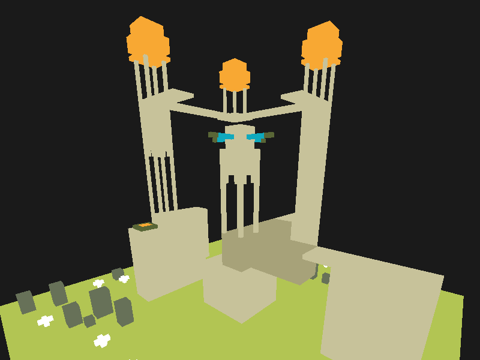

# Voxel Raycaster (C++ and Vulkan)

This is the second voxel renderer I have written. The first was with c++ opengl
but I have lost the source.

A compute shader raycasts into a simple voxel grid.

